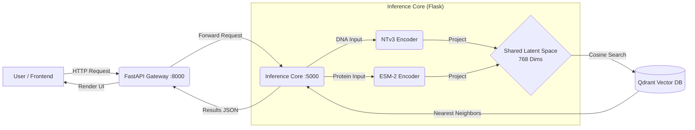

# 🧬 SYNAPSE

### Multimodal Biological Intelligence: Bridging the Gap Between DNA and Proteins

> **"DNA is fast, but understanding is slow."**
> Synapse eliminates the translation loss between Genomics and Proteomics by unifying them into a **Shared Latent Space**, turning heavy protein folding simulations into instant geometric search problems.

---

## 📚 Table of Contents

* [🧐 The Problem](https://www.google.com/search?q=%23-the-problem)
* [💡 The Solution](https://www.google.com/search?q=%23-the-solution)
* [🏗️ Architecture](https://www.google.com/search?q=%23-architecture)
* [⚡ Quick Start](https://www.google.com/search?q=%23-quick-start)
* [🔥 Key Features](https://www.google.com/search?q=%23-key-features)
* [📂 Project Structure](https://www.google.com/search?q=%23-project-structure)
* [🛣️ Roadmap](https://www.google.com/search?q=%23-roadmap)
* [👥 The Team](https://www.google.com/search?q=%23-the-team)

---

## 🧐 The Problem

Modern biological research faces a critical **"Interpretation Gap"**.

1. **The VUS Crisis:** We find "typos" (mutations) in DNA daily, but determining if they are dangerous requires weeks of expert analysis.
2. **The Computational Wall:** Tools like AlphaFold are revolutionary but computationally massive. "Folding" a protein to check a single mutation is too slow for critical care.
3. **Siloed Intelligence:** DNA models (Nucleotide Transformer) and Protein models (ESM) speak different languages, leading to information loss during translation.

## 💡 The Solution

**Synapse** acts as an intelligent "Adapter Layer". Instead of translating text, we project biological data into a **Shared Latent Space (768 dimensions)**.

* 
**Multimodal Embeddings:** We use **NTv3** (DNA) and **ESM-2** (Protein) to create high-dimensional vectors.


* 
**Mathematical Alignment:** A custom **Projection Head** (Linear -> LayerNorm -> GELU) maps these vectors so that a DNA sequence and its resulting Protein structure land in the same spot on the map.


* 
**Geometry over Tables:** We use **Qdrant** to store these vectors, allowing us to find biological matches via "Nearest Neighbor" search in milliseconds.


---

## 🏗️ Architecture

The system follows a **Service-Oriented Architecture** separating the heavy inference core from the user-facing gateway.



### 🛠️ Tech Stack

* 
**Edge Gateway:** FastAPI (Python) + Jinja2 Templates + HTMX 


* 
**Inference Core:** Flask (Python) + PyTorch 


* 
**Genomics Model:** `InstaDeepAI/nucleotide-transformer-v3` 


* 
**Proteomics Model:** `facebook/esm2_t33_650M_UR50D` 


* 
**Vector Database:** Qdrant (Dockerized) 


* 
**Visualization:** Plotly.js (2D Latent Map) + 3Dmol.js (Protein Structures) 


---

## ⚡ Quick Start

### Prerequisites

* [Docker Desktop](https://www.docker.com/) (Required for Qdrant)
* Python 3.9+
* Git

### 1. Clone the Repository

```bash
git clone https://github.com/eyaChikhaoui/Synapse.git
cd Synapse-main

```

### 2. Set Up Environment

It is recommended to use a virtual environment.

```bash
python -m venv venv
# Windows:
venv\Scripts\activate
# Mac/Linux:
source venv/bin/activate

pip install -r requirements.txt

```

### 3. Launch Infrastructure (Qdrant)

Start the vector database container in the background.

```bash
docker-compose up -d

```

*Verify Qdrant is running at `http://localhost:6333/dashboard*` 

### 4. Run the System

You need to run two services in separate terminals:

**Terminal A (Inference Core):**

```bash
python src/main.py
# Runs on localhost:5000

```


**Terminal B (Edge Gateway):**

```bash
python src/Backend/App.py
# Runs on localhost:8000

```


*Access the UI at `http://localhost:8000*`

---

## 🔥 Key Features

### 1. Zero-Shot Variant Scoring (The "Deal Breaker")

Instantly assess the impact of a genetic mutation without expensive simulations.

* 
**How:** Calculates the cosine distance between the "Wild Type" (normal) and "Mutant" vectors.


* **Output:** A similarity score (0-100%). Low similarity = High Pathogenicity.


### 2. RL-Ready Reward API

A machine-readable endpoint designed for Reinforcement Learning agents.

* **Use Case:** Can be used as a "fitness function" for Generative AI models designing new proteins.
* 
**Endpoint:** `POST /api/reward` -> Returns scalar float.


### 3. Batch Processing

High-throughput analysis pipeline.

* 
**Capacity:** Process 1000+ sequences via text input or file upload (JSON/CSV/PDF).


* 
**Performance:** Utilizes Qdrant's batch search for sub-second retrieval.


### 4. Lab Report Generation

One-click PDF generation for documenting findings.

* 
**Includes:** 3D structure snapshots, latent space charts, and variant impact assessment.


---

## 📂 Project Structure

```text
Synapse-main/
├── src/
│   ├── Backend/             # FastAPI Gateway (Port 8000)
│   │   ├── Controllers/     # UI Logic & PDF Generation
│   │   ├── Routers/         # API Routes
│   │   ├── Template/        # HTML/Jinja2 Frontend
│   │   ├── static/          # CSS, JS, & Assets
│   │   └── App.py           # Gateway Entry Point
│   │
│   ├── database/            # Data Layer
│   │   ├── db_manager.py    # Qdrant Connector
│   │   ├── loader.py        # SOTA Parquet Loader
│   │   └── *_pipeline.py    # Offline Embedding Generators
│   │
│   ├── encoders/            # AI Model Wrappers
│   │   ├── dna_encoder.py   # NTv3 + Projection Head
│   │   └── protein_encoder.py # ESM-2 + Projection Head
│   │
│   ├── models/              # Neural Network Weights
│   │   ├── synapse_sota.py  # Projection Head Architecture
│   │   └── *.pth            # Trained Weights
│   │
│   └── main.py              # Flask Inference Core (Port 5000)
│
├── docker-compose.yaml      # Qdrant Infrastructure
├── requirements.txt         # Dependencies
└── README.md                # Documentation

```


---

## 🛣️ Roadmap

* [x] **Phase 1: Foundation**
* [x] Dockerized Qdrant Setup 


* [x] Shared Latent Space Definition (768-dim) 


* [x] Dual-Service Architecture (FastAPI + Flask) 


* [x] **Phase 2: The Bridge (SOTA)**
* [x] Integrate `nucleotide-transformer-v3` 


* [x] Integrate `esm2_t33_650M_UR50D` 


* [x] Implement Custom Projection Heads (Linear -> GELU -> Norm) 


* [x] **Phase 3: Production Features**
* [x] Zero-Shot Variant Scoring API 


* [x] Batch Processing (Text & File) 


* [x] PDF Report Generation 


* [x] 3D Protein Visualization (PDB) 


---

## 👥 The Team

**Team Wasa3 Methniya**

* **Eya Chikhaoui** - AI Research & Backend Lead
* **Balkis Mahjoubi** - Product Strategy & Data
* **Aziz Mazghouni** - Frontend Engineering & Viz
* **Mouhamed Gharsallah** - DevOps & Infrastructure

---

*Built with 💻 and 🧬 in Tunisia.*
