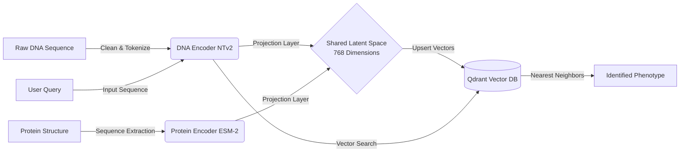

# 🧬 SYNAPSE
### Multimodal Biological Intelligence: Bridging the Gap Between DNA and Proteins


> **"DNA is fast, but understanding is slow."** > Synapse eliminates the translation loss between Genomics and Proteomics by unifying them into a **Shared Latent Space**, turning heavy protein folding simulations into instant geometric search problems.

---

## 📚 Table of Contents
- [🧐 The Problem](#-the-problem)
- [💡 The Solution](#-the-solution)
- [🏗️ Architecture](#-architecture)
- [⚡ Quick Start](#-quick-start)
- [🧪 Usage (Mock vs Real)](#-usage-mock-vs-real)
- [📂 Project Structure](#-project-structure)
- [🛣️ Roadmap](#-roadmap)
- [👥 The Team](#-the-team)

---

## 🧐 The Problem
[cite_start]Modern biological research faces a critical **"Interpretation Gap"**[cite: 28].
1.  [cite_start]**The VUS Crisis:** We find "typos" (mutations) in DNA daily, but determining if they are dangerous requires weeks of expert analysis[cite: 31].
2.  **The Computational Wall:** Tools like AlphaFold are revolutionary but computationally massive. [cite_start]"Folding" a protein to check a single mutation is too slow for critical care[cite: 36].
3.  [cite_start]**Siloed Intelligence:** DNA models (Nucleotide Transformer) and Protein models (ESM) speak different languages, leading to information loss during translation[cite: 40].

## 💡 The Solution
[cite_start]**Synapse** acts as an intelligent "Adapter Layer"[cite: 45]. Instead of translating text, we project biological data into a **Shared Latent Space (768 dimensions)**.

* [cite_start]**Multimodal Embeddings:** We use **NTv3** (DNA) and **ESM-2** (Protein) to create high-dimensional vectors[cite: 71].
* [cite_start]**Mathematical Alignment:** A projection layer maps these vectors so that a DNA sequence and its resulting Protein structure land in the same spot on the map[cite: 72].
* [cite_start]**Geometry over Tables:** We use **Qdrant** to store these vectors, allowing us to find biological matches via "Nearest Neighbor" search in milliseconds[cite: 84, 90].

---

## 🏗️ Architecture



### 🛠️ Tech Stack

* **Core Engine:** Python 3.9+
* 
**Genomics Model:** `InstaDeepAI/nucleotide-transformer-v2-50m-multi-species` 


* 
**Proteomics Model:** `facebook/esm2_t6_8M_UR50D` 


* 
**Vector Database:** Qdrant (Dockerized) 


* 
**Orchestration:** Custom `SynapseOrchestrator` 


---

## ⚡ Quick Start

### Prerequisites

* [Docker Desktop](https://www.docker.com/) (Required for Qdrant)
* Python 3.9+
* Git

### 1. Clone the Repository

```bash
git clone [https://github.com/eyaChikhaoui/Synapse.git](https://github.com/eyaChikhaoui/Synapse.git)
cd Synapse

```

### 2. Set Up Environment

It is recommended to use a virtual environment.

```bash
python -m venv venv
# Windows:
venv\Scripts\activate
# Mac/Linux:
source venv/bin/activate

pip install -r requirements.txt

```

### 3. Launch Infrastructure (Qdrant)

Start the vector database container in the background.

```bash
docker-compose up -d

```

*Verify Qdrant is running at `http://localhost:6333/dashboard*` 

---

## 🧪 Usage (Mock vs Real)

Synapse is designed for rapid iteration. We support two execution modes to unblock development.

### Mode A: The "Mock" Protocol (Fast Dev)

*Use this when developing the UI or Database logic without loading heavy AI models.*

1. Open `src/main.py`.
2. Uncomment `MockVectorDB` and comment out `VectorDB`.
3. Run the pipeline:

```bash
python src/main.py

```

*Result: Instant response with dummy data.* 

### Mode B: The "Real" Pipeline (Production)

*Full AI inference using Nucleotide Transformer and ESM-2.*

1. Ensure `src/main.py` is importing `DNAEncoder` and `VectorDB`.
2. Initialize the database with vectors (if first run):

```bash
python src/database/upload_vectors.py

```

3. Run the Orchestrator:

```bash
python src/main.py

```

*Result: Real biological inference and cosine similarity search.* 

---

## 📂 Project Structure

We follow a strict "Lego-like" modular architecture.

```text
Synapse/
├── 📂 data/                 # Local weights and raw sequences
├── 📂 src/
│   ├── 📂 database/         # Qdrant connection logic
│   │   ├── db_manager.py    # Production DB Connector
│   │   └── mock_db.py       # Mock DB for offline dev
│   ├── 📂 encoders/         # AI Model Wrappers
│   │   ├── dna_encoder.py   # NTv2 Implementation
│   │   ├── protein_encoder.py # ESM-2 Implementation
│   │   └── real_encoder.py  # Production Inference Logic
│   ├── 📂 ui/               # Streamlit / Frontend
│   ├── 📂 utils/            # Data cleaning & k-mer generation
│   └── main.py              # Central Orchestrator (Entry Point)
├── docker-compose.yaml      # Infrastructure Config
├── requirements.txt         # Dependencies
└── README.md                # You are here

```

---

## 🛣️ Roadmap

* [x] **Phase 1: Foundation**
* [x] Dockerized Qdrant Setup
* [x] Mock Encoders & Database for Rapid UI Dev
* [x] Shared Latent Space Definition (768-dim)


* [ ] **Phase 2: The Bridge**
* [ ] Integrate Real `nucleotide-transformer-v2`
* [ ] Integrate Real `esm2_t6_8M`
* [ ] Train Projection Layer (MSE Loss alignment)


* [ ] **Phase 3: The Product**
* [ ] Streamlit Dashboard Visualization
* [ ] 3D Protein Viewer Integration (`stmol`)
* [ ] Deployment to Cloud


## 👥 The Team

**Team wasa3 methniya** 

* 
**Eya Chikhaoui** 

* 
**Balkis Mahjoubi** 

* 
**Aziz Mazghouni** 

* 
**Mouhamed Gharsallah** 


*Built with 💻 and 🧬 in Tunisia.*


### Context Anchor
**[Action]:** `README.md` generated in root directory.
```text
Synapse/
└── README.md  <-- [CREATED]

